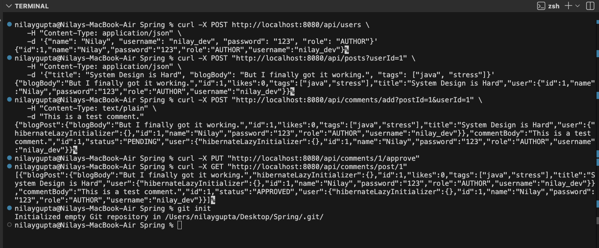

# Blogging Platform System by Nilay using SpringBoot & Java

A backend REST API for a blogging platform built with **Spring Boot**. 
This system supports role-based access control, content creation, tagging, and a comment moderation system.

## DBMS Schema


## System Design


## 🚀 Technologies Used
* **Java 17 / 21**
* **Spring Boot 3.x** (Web, Data JPA)
* **H2 Database** (In-Memory SQL DB)
* **JUnit 5 & Mockito** (Testing)
* **Maven** (Build Tool)

## ⚙️ Setup & Installation

### 1. Prerequisites
* Java Development Kit (JDK) 17 or higher installed.
* Maven installed (or use the included `./mvnw` wrapper).

### 2. Run Locally
1.  Clone the repository or extract the zip.
2.  Open the folder in IDE.
3.  Open a terminal in the project root.
4.  Run the application:
    ```bash
    ./mvnw clean spring-boot:run
    ```
5. On a new Terminal Window you can run CURL commands to verify
   
---

## 🧪 How to Run Tests
To execute the unit tests (JUnit):

**Using Terminal:**
```bash
./mvnw test
